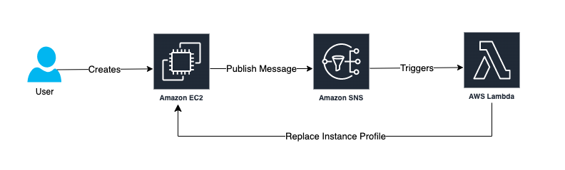
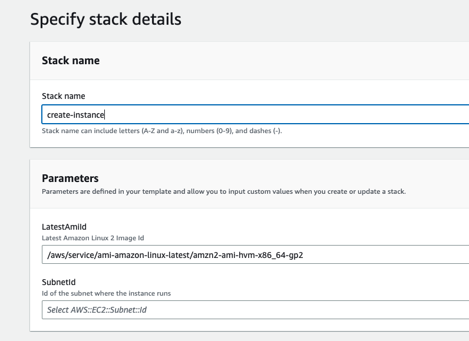

## Update EC2 Instance Profile Lambda

The purpose of this Lambda function is to update the instance profile of any EC2 instance within an AWS account.  Imagine a scenario where access to a secret in AWS Secrets Manager or elevated permissions to other AWS services are needed to provision the EC2 instance but once the instance is up and running, it should no longer have access to that secret or those permissions.  Rather than having to update the instance profile manually, this Lambda function automates that process.  It is triggered through an SNS topic that can be invoked in the EC2 instance's user data and it gets the new instance role using tags.

### Process Diagram

### Deployment Steps

1. Log into AWS Console 
2. Deploy the update_ec2_instance_profile_lambda.yml Cloudformation template.  This will create the Lambda function, the IAM role associated with the function and the SNS topic to trigger the Lambda function.
3. Deploy the create_ec2_instance.yml Cloudformation template.  This will create an EC2 instance using the latest Amazon Linux 2 AMI and two IAM roles.  EC2ProvisioningRole will be used to create the EC2 instance and EC2RunningRole will be used after the instance is running. 
4. During EC2 creation, observe that the instance profile used is EC2ProvisioningRole and after the instance is running, the profile changes to EC2RunningRole.

### Additional Information

The EC2 instance profile replacement Lambda looks for a tag named **InstanceProfileName** on the instance.  If the tag is not found when the Lambda is run, the Lambda will gracefully exit and the existing instance profile will not be replaced.

The Lambda logs can be found in the **/aws/lambda/EC2ReplaceInstanceProfileLambda** log group in Cloudwatch.

## Security

See [CONTRIBUTING](CONTRIBUTING.md#security-issue-notifications) for more information.

## License

This library is licensed under the MIT-0 License. See the LICENSE file.